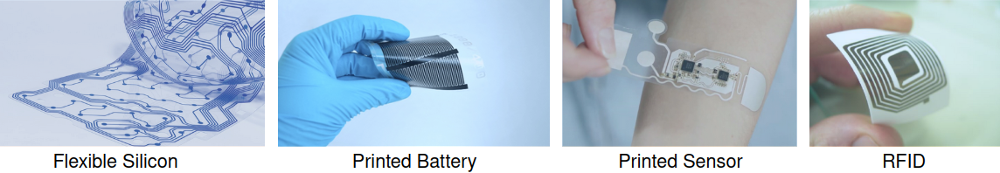
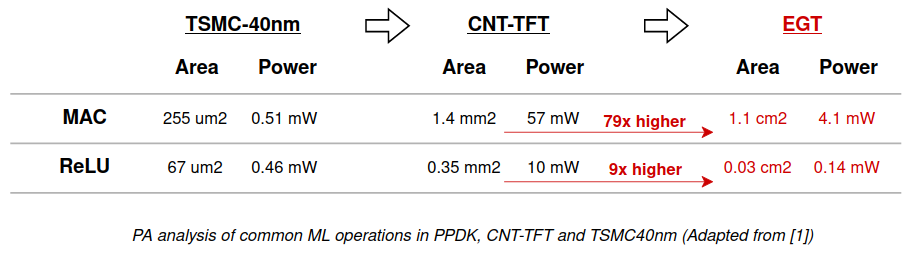

# Approximate Printed Machine Learning Classifiers

<p align="center">
  <a href="#overview">Overview</a> •
  <a href="#exact-baseline-models">Baseline models</a> •
  <a href="#evaluate-fp32-models">Accuracy evaluation</a> •
  <a href="#Cross-layer-Approximations-for-Printed-ML-Circuits">Our works</a> •  
  <a href="#measured-results"> Measured Results </a> •
  <a href="#references">References</a> 
</p>

## Overview
Printed electronics denotes a set of printing methods which
can realize ultra low-cost, large area and flexible computing systems in combination with functional materials to realize transistors and passive components on various substrates.



But the large feature sizes (orders of magnitude lower than silicon VLSI) and the tight power budget (printed batteries support <30 mW), make **Machine Learning** deployment difficult.

<p align="center">
  
</p>


## Exact baseline models
In the following table the floating-point accuracy of the 4 different classification algorithms trained on 7 different datasets are presented:

|            | MLP-R | MLP-C | SVM-C  | SVM-R  | 
|------------|----------|----------|------|------|
| RedWine    | 0.57     | 0.56     | 0.56 | 0.58 | 
| WhiteWine  | 0.53     | 0.54     | 0.53 | 0.53 |
| Cardio     | 0.84     | 0.89     | 0.90 | 0.84 | 
| Pendigits  | 0.39     | 0.94     |  0.98    |  0.23 | 
| Seeds  | 0.94     | 0.87     |  0.92    |  0.75 | 
| Vertebral Column 3C | 0.83 | 0.72 | 0.84 | 0.66 |
| Balance Scale  | 0.91     | 0.86     |  0.89    |  0.81 | 


## Evaluate FP32 Models

This section provides instructions on how to calculate the floating-point accuracy of Python (.joblib) models using the `fp_calc_accuracy.py` script.

### Usage

Execute the following command in your terminal:

```bash
python3 fp_calc_accuracy.py <name_of_dataset> <python_model_name>
```

#### Example

```bash
python3 fp_calc_accuracy.py Cardio ./baseline_models/python/Cardio.MLP_clf_nosearch.joblib
```

#### Output

```bash
FP ACCURACY W/ MODEL: 0.8871473354231975
```

## Evaluate HDL Exact/Approx Models

For evaluating the simulation accuracy of exact or approximate models, a simulation of the corresponding testbench is required. After simulation, a `sim_output.txt` file will be generated in the same `/testbench` directory. Use the following command to evaluate accuracy:

### Usage

```bash
python3 sim_calc_accuracy.py <name_of_model> <expected_outputs> <sim_outputs>
```

#### Example

```bash
python3 sim_calc_accuracy.py Cardio_MLP_C_exact ./baseline_models/hdl/testbench/IO/Cardio_expected_outputs.txt ./baseline_models/hdl/testbench/sim_outputs.txt
```

#### Output

```bash
accuracy: 0.8808777429467085
```

## Cross-layer Approximations for Printed ML Circuits [4]

For detailed information on cross-layer approximations in printed machine learning circuits, refer to the `./Cross-layer approximations for printed ML circuits` directory.

## Co-Design of Approximate Multilayer Perceptron for Ultra-Resource Constrained Printed Circuits [6]

Explore the co-design approaches for developing approximate Multilayer Perceptrons (MLP) suitable for ultra-resource-constrained printed circuits in the `./Cross-layer approximations for printed ML circuits` directory.

## On-sensor Printed Machine Learning Classification via Bespoke ADC and Decision Tree Co-Design [7]

For insights into on-sensor printed machine learning classification facilitated by bespoke ADC and Decision Tree co-design, visit the `./On-sensor Printed Machine Learning Classification via Bespoke ADC and Decision Tree Co-Design` directory.


## Measured Results

- All the models are synthesized using Synopsys Design Compiler and open-source EGT PDK. 
- Circuit simulations and power analysis are performed using Questasim and PrimeTime, respectively.
- All the **area** and **power** results are for MLP-C classification algorithm and for 1% accuracy threshold w.r.t. our baseline models [1].
- More results, models, scripts and PDKs are available from the corresponding author upon request.

The **area** results:


| Dataset             |Baseline [1]| SC [3] | Cross_approx [5] | Retrain&AxSum [6]  |              
|---------------------|-------------|-------|--------|------|
| Cardio              | 33.4 cm²        | 4.9 cm²  | 17 cm²    | 6.1 cm² |
| RedWine             | 17.6 cm²       | -     | 8 cm²     | 1.1 cm² |     
| WhiteWine           | 31.2 cm²       | -     | 13.6 cm²  | 6.5 cm² |     
| Seeds               | 9.9 cm²        | 2.1 cm²  | 9.2 cm²   | 2.2 cm² |  
| Vertebral Column 3C | 8.8 cm²        | 1.9 cm²  | 5.9 cm²   | 1.8 cm² |  
| Balance Scale       | 9.3 cm²        | 1.5 cm²  | 6.9 cm²   | 0.5 cm² |  

The **power** results:

| Dataset             | Baseline [1] | SC [3] | Cross_approx [5] | Retrain&AxSum [6] |
|---------------------|--------------|--------|------------------|--------------------|
| Cardio              | 124.2 mW    | 22.9 mW | 48.9 mW          | 20.8 mW           |
| RedWine             | 73.5 mW     | -    | 18.8 mW          | 3.9 mW            |
| WhiteWine           | 126.4 mW    | -    | 43.2 mW          | 21.3 mW           |
| Seeds               | 45 mW        | 9.8 mW  | 27.9 mW          | 8.4 mW            |
| Vertebral Column 3C | 41.9 mW      | 8.9 mW  | 31.6 mW          | 7 mW              |
| Balance Scale       | 39.6 mW      | 7.1 mW  | 17.8 mW          | 2.1 mW            |


## References:
[1] M. H. Mubarik et al., "Printed Machine Learning Classifiers," 2020 53rd Annual IEEE/ACM International Symposium on Microarchitecture (MICRO), Athens, Greece, 2020, pp. 73-87, doi: 10.1109/MICRO50266.2020.00019.

All of the datasets were obtained from the UCI Machine Learning Repository:

[2] Dua, D. and Graff, C. (2019). UCI Machine Learning Repository [http://archive.ics.uci.edu/ml]. Irvine, CA: University of California, School of Information and Computer Science.

[3] D. D. Weller et al., "Printed Stochastic Computing Neural Networks," 2021 Design, Automation & Test in Europe Conference & Exhibition (DATE), Grenoble, France, 2021, pp. 914-919, doi: 10.23919/DATE51398.2021.9474254.

[4] G. Armeniakos, G. Zervakis, D. Soudris, M. B. Tahoori and J. Henkel, "Cross-Layer Approximation For Printed Machine Learning Circuits," 2022 Design, Automation & Test in Europe Conference & Exhibition (DATE), Antwerp, Belgium, 2022, pp. 190-195, doi: 10.23919/DATE54114.2022.9774689.
[[ArXiv link]](https://arxiv.org/abs/2203.05915)

[5] G. Armeniakos, G. Zervakis, D. Soudris, M. B. Tahoori and J. Henkel, "Model-to-Circuit Cross-Approximation For Printed Machine Learning Classifiers," in IEEE Transactions on Computer-Aided Design of Integrated Circuits and Systems, doi: 10.1109/TCAD.2023.3258668.
[[ArXiv link]](https://arxiv.org/abs/2303.08255)

[6] G. Armeniakos, G. Zervakis, D. Soudris, M. B. Tahoori and J. Henkel, "Co-Design of Approximate Multilayer Perceptron for Ultra-Resource Constrained Printed Circuits," in IEEE Transactions on Computers, doi: 10.1109/TC.2023.3251863.
[[ArXiv link]](https://arxiv.org/abs/2302.14576)

[7] G. Armeniakos, P. L. Duarte, P. Pal, G. Zervakis, M. B. Tahoori and D. Soudris, "On-sensor Printed Machine Learning Classification via Bespoke ADC and Decision Tree Co-Design", 2024 Design, Automation & Test in Europe Conference & Exhibition (DATE), Valencia, Spain, 2024.
[[ArXiv link]](https://arxiv.org/abs/2312.01172)

### Citation:

If you find our project helpful, please consider citing our paper:

```
@INPROCEEDINGS{
  arm2022crosslayer,
  author={Armeniakos, Giorgos and Zervakis, Georgios and Soudris, Dimitrios and Tahoori, Mehdi B. and Henkel, Jörg},
  booktitle={2022 Design, Automation & Test in Europe Conference & Exhibition (DATE)}, 
  title={Cross-Layer Approximation For Printed Machine Learning Circuits}, 
  year={2022}
}

@ARTICLE{
  arm2023crossapprox,
  author={Armeniakos, Giorgos and Zervakis, Georgios and Soudris, Dimitrios and Tahoori, Mehdi B. and Henkel, Jörg},
  journal={IEEE Transactions on Computer-Aided Design of Integrated Circuits and Systems}, 
  title={Model-to-Circuit Cross-Approximation For Printed Machine Learning Classifiers}, 
  year={2023}
  }


@ARTICLE{
  arm2023codesign,
  author={Armeniakos, Giorgos and Zervakis, Georgios and Soudris, Dimitrios and Tahoori, Mehdi B. and Henkel, Jörg},
  journal={IEEE Transactions on Computers}, 
  title={Co-Design of Approximate Multilayer Perceptron for Ultra-Resource Constrained Printed Circuits}, 
  year={2023},
  pages={1-8}
  }
  
@misc{
  armeniakos2024onsensor,
  title={On-sensor Printed Machine Learning Classification via Bespoke ADC and Decision Tree Co-Design}, 
  author={Giorgos Armeniakos and Paula L. Duarte and Priyanjana Pal and Georgios Zervakis and Mehdi B. Tahoori and Dimitrios Soudris},
  year={2023},
  eprint={2312.01172},
  archivePrefix={arXiv},
  primaryClass={cs.LG}
}

```

